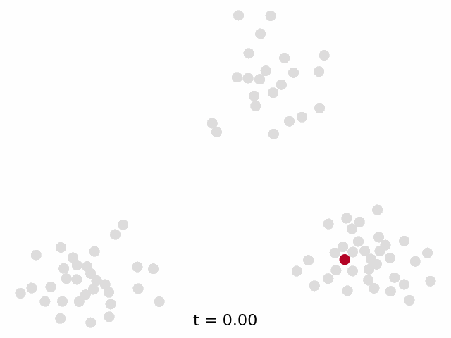

# DeFoG: Discrete Flow Matching for Graph Generation

> A PyTorch implementation of the DeFoG model for training and sampling discrete graph flows. (Please update to the latest commit. Recent fixes have been applied.)

> Paper: https://arxiv.org/pdf/2410.04263

> Poster: https://icml.cc/virtual/2025/poster/45644

> Oral Presentation: https://icml.cc/virtual/2025/oral/47238

  
   

---
